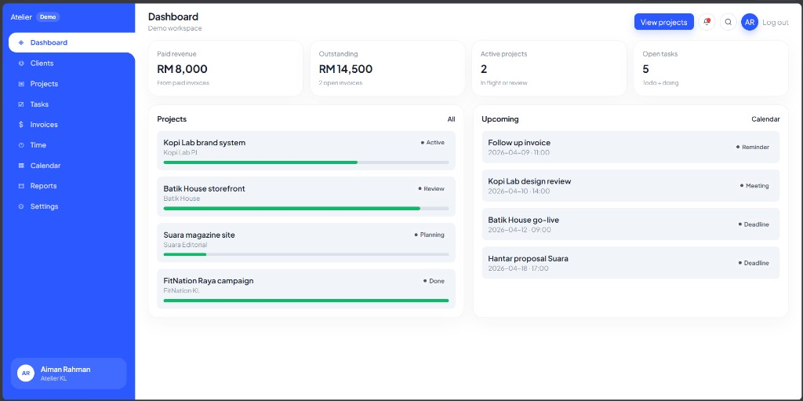

# Studio Management System

**Atelier** is a complete studio operating system for freelancers and small creative teams. It keeps clients, projects, tasks, invoices, time, and calendar in one workspace so you can run work from first lead to paid invoice.

Repository: [Mierul01/studio-management-system](https://github.com/Mierul01/studio-management-system)



The screenshot above is the live **Dashboard**: a full-page SaaS layout with a cobalt sidebar, compact header, and a Malaysian demo studio (Atelier KL). Money is in **RM**, and sample clients include Kopi Lab PJ, Batik House, Suara Editorial, and FitNation KL.

---

## What this system is

Studios usually split work across spreadsheets, chat, and a separate billing tool. Atelier is built as one product you can demo, use, or sell:

- Capture **clients** and pipeline value
- Run **projects** and a **task** board
- Log **time**, send **invoices**, and watch what is paid or overdue
- Plan meetings and deadlines on a **calendar**
- Review performance in **reports**

Typical users: freelance designers and developers, small studio owners, and anyone who needs a ready SaaS demo to customize.

---

## How the product works

### Public site
| Page | What it does |
|------|----------------|
| Landing | Product story, feature list, sign in / register, demo launch |
| Login | Optional account sign-in (saved in this browser) |
| Register | Optional studio account creation |

Login and register are optional. **Open the demo** loads a full workspace with sample data so buyers can click around immediately.

### App workspace
| Module | What it does |
|--------|----------------|
| Dashboard | Paid revenue, outstanding invoices, active projects, open tasks, upcoming events |
| Clients | Add / edit / delete leads, active, and paused clients |
| Projects | Budget, status, progress bar, due date, linked to a client |
| Tasks | Kanban board: todo → doing → done, with priority |
| Invoices | Draft → send → paid / overdue |
| Time | Live timer plus manual billable logs |
| Calendar | Month view for meetings, deadlines, reminders |
| Reports | Invoice totals, hours by project, top clients |
| Settings | Workspace preferences |
| Profile | Studio identity (opened from the sidebar name or avatar) |
| Messages | Client inbox (opened from the notification bell) |
| Help | Short in-app guides |

**Sidebar** stays on the important daily modules: Dashboard, Clients, Projects, Tasks, Invoices, Time, Calendar, Reports, Settings.

**Bell** opens a notification popup first. Clicking a row opens that exact message. **Name + avatar** at the bottom of the sidebar opens Profile.

---

## Interface design

The app shell matches a modern SaaS dashboard:

- Full-page layout (no outer gap around the window)
- Cobalt blue sidebar with a white “cut-in” tab for the active page
- Compact white header: page title, count/subtitle, action button, bell, search, avatar, log out
- Soft gray page background, rounded white cards, status pills with colored dots
- Tables (Clients, Invoices) highlight the hovered row in blue
- Typography: **Plus Jakarta Sans**, sized to stay compact on a dashboard rather than oversized marketing type

---

## System design

```
Browser (React SPA)
  ├── Landing / Login / Register
  └── App shell
        ├── Fixed cobalt sidebar
        ├── Compact header + notification popup
        └── Feature pages
              └── AuthContext + DataContext
                    └── localStorage
```

**Stack:** React 19, TypeScript, Vite, React Router, Tailwind CSS v4.

This is a front-end complete product. No server is required. It is ready to demo or sell, and can later sit on a real API, database, and auth.

### Auth
- Register with name, email, password, company
- Accounts and passwords stay in the browser (demo-grade, not production security)
- Session stores `{ user, isDemo }`
- Demo mode loads seeded studio data
- Log out clears the session and returns to landing

### Main data
- **User** — profile and studio identity
- **Client** — contact, status, pipeline value
- **Project** — client, budget, progress, status
- **Task** — project, priority, kanban status
- **Invoice** — client, amount, lifecycle
- **TimeEntry** — project, minutes, billable flag
- **CalendarEvent** — meeting / deadline / reminder
- **Message** — inbox notifications
- **FileItem** — assets tied to projects

### Persistence
| Key | Stores |
|-----|--------|
| `atelier_users` | Registered accounts |
| `atelier_session` | Current session |
| `atelier_data_demo` | Demo workspace |
| `atelier_data_<userId>` | Per-user workspace |

---

## Getting started

Requires Node.js 20+ (22 recommended).

```bash
npm install
npm run dev
```

Open the URL Vite prints (usually `http://localhost:5173`).

| Command | Description |
|---------|-------------|
| `npm run dev` | Development server |
| `npm run build` | Typecheck and production build to `dist/` |
| `npm run preview` | Preview the production build |

---

## How to demo

1. Open the landing page
2. Click **Open the demo** (or Sign in / Register)
3. Walk through Dashboard → Clients → Projects → Tasks
4. Show Time → Invoices → Reports
5. Click the bell, then a notification, to prove it opens the correct message
6. Click the sidebar name to open Profile

Deploy the `dist/` folder to Vercel, Netlify, Cloudflare Pages, or GitHub Pages.

---

## Possible next layer

- Real backend (auth + database)
- Team seats and roles
- PDF invoice export
- Email for invoices and messages
- Stripe / payment links

---

## License

Private / commercial use by the repo owner unless otherwise stated.
